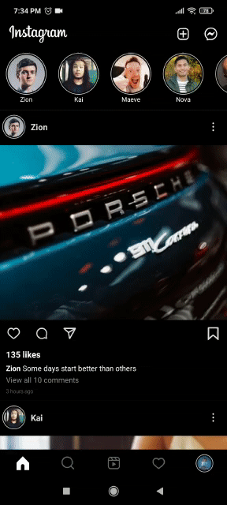
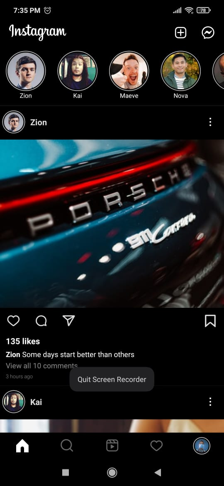
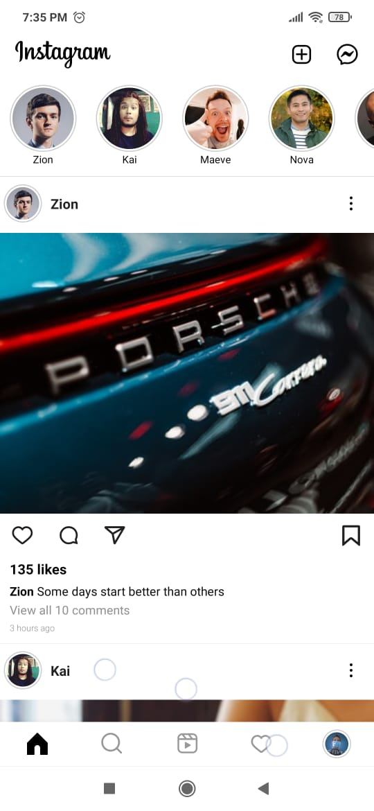

# Instagram with Jetpack Compose

Instagram with Jetpack Compose is an instagram clone app made with [Jetpack Compose](https://developer.android.com/jetpack/compose)

This instagram clone app aims to replicate the :

* Home Screen

* Search Screen

* Reels Screen

* Activity Screen

* Profile Screen

  
  
  

This Instagram clone app is still under development, so  some screens are not yet implemented

Libraries used:

* Compose Toolkit

* [Compose Destinations](https://github.com/raamcosta/compose-destinations)

* Kotlin Coroutines

This sample project foucses on replicating the instagram ui using Jetpack Compose, So same dummy data is used in every screen

